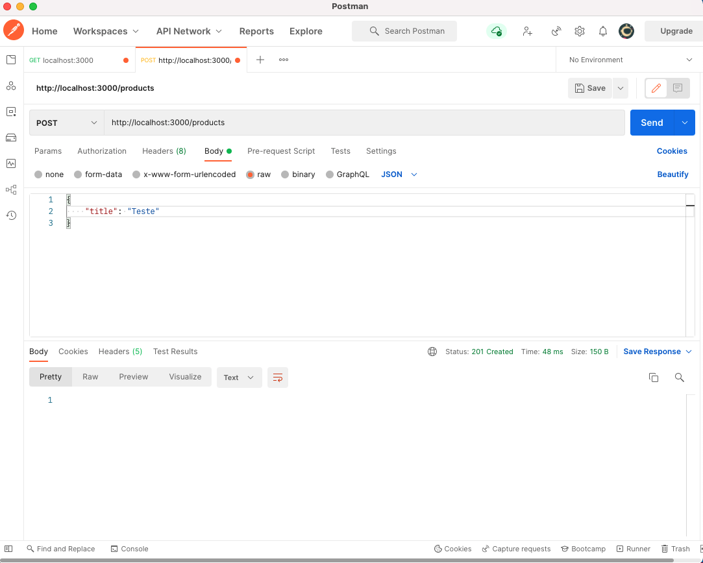
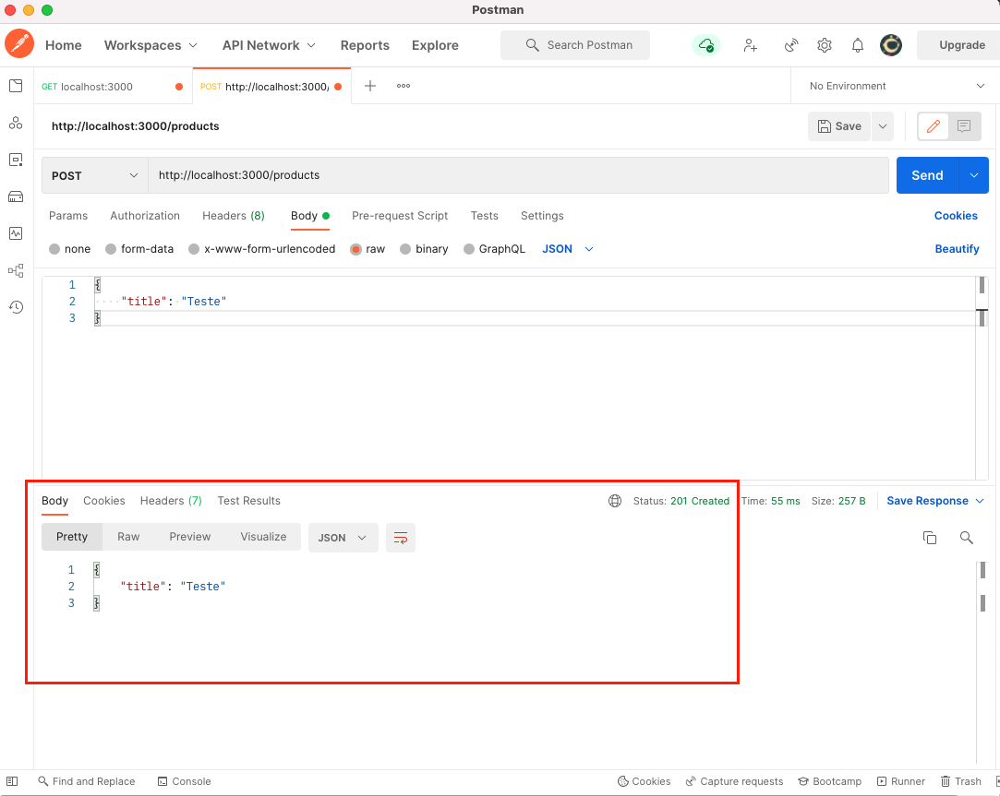
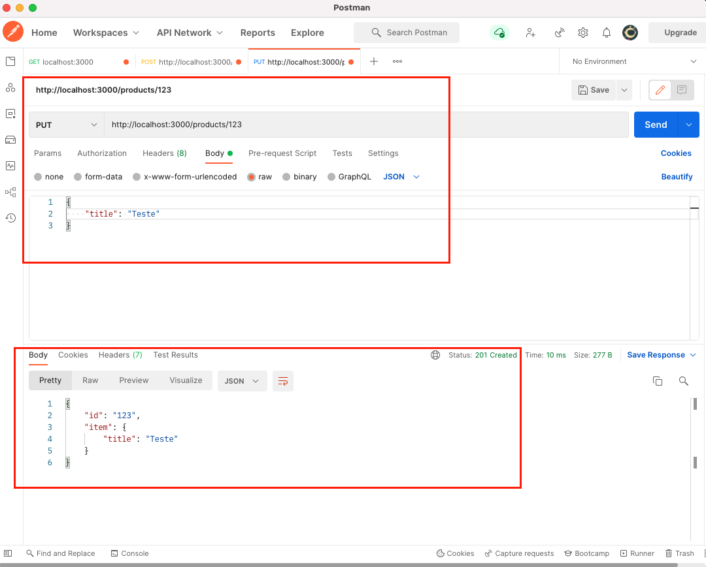
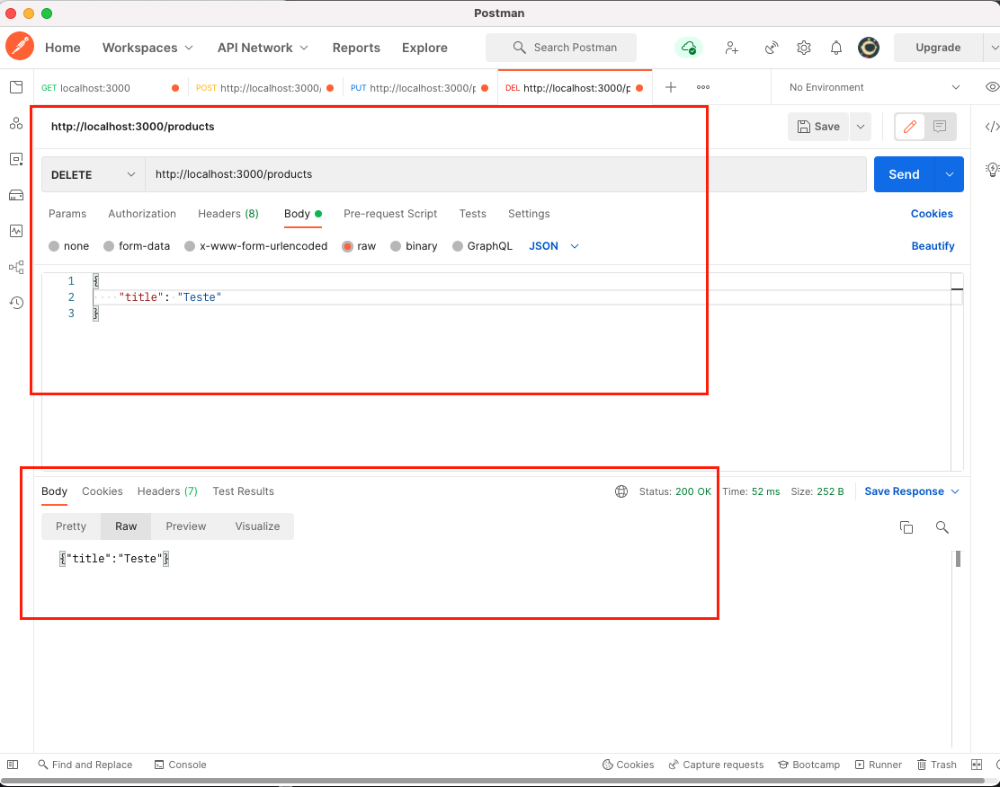
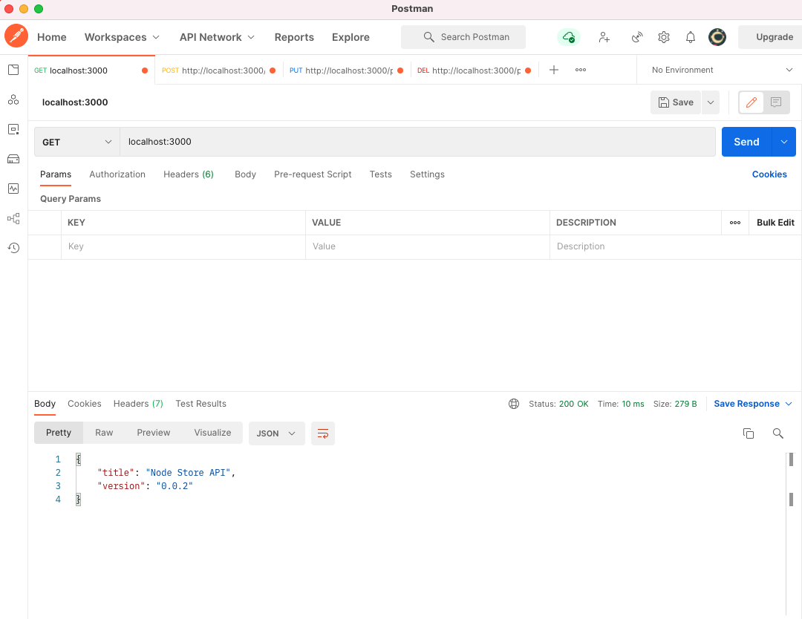
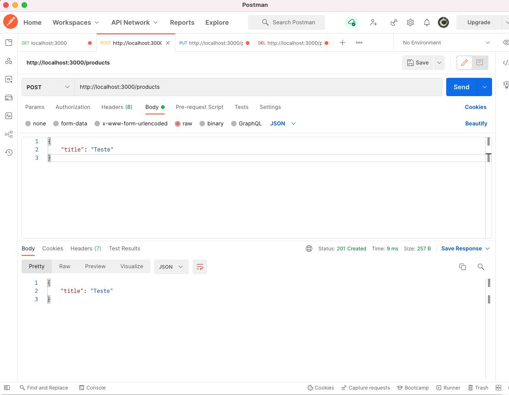
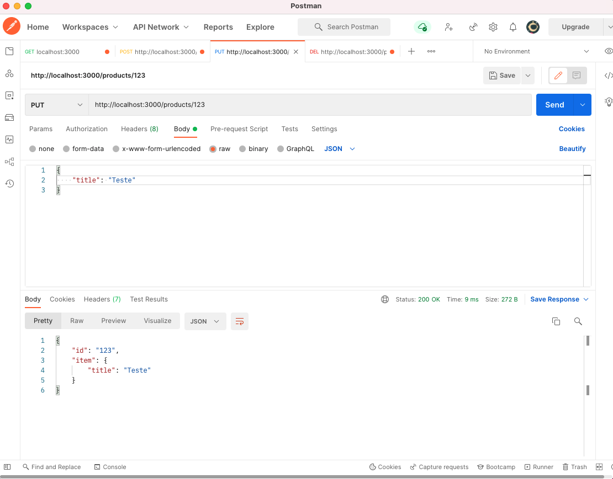
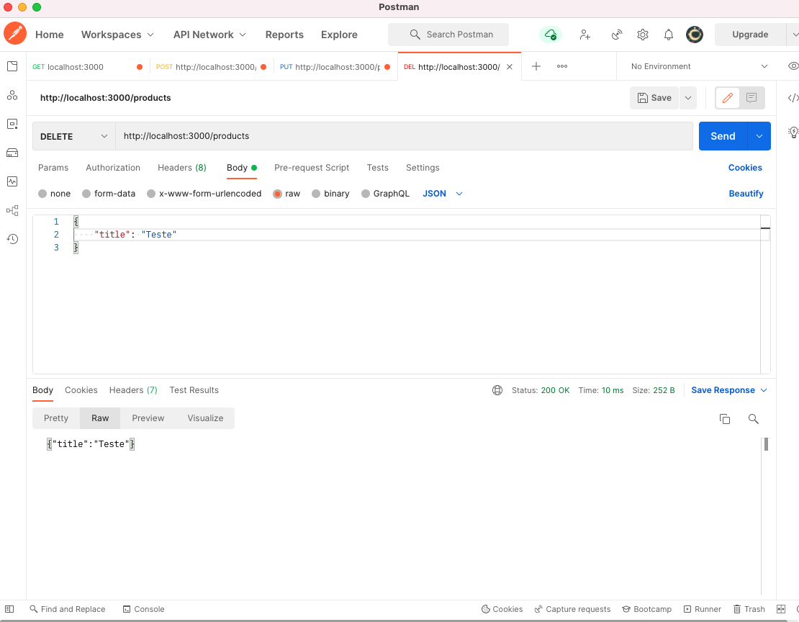

# Criando APIs com NodeJs

- Utilizando o padrão **M V C**

  - M o d e l
  - V i e w
  - C o n t r o l l e r

|  C R U D      |   R E S T                  |
|---------------|----------------------------|
| C r e a t e   |  &rarr; P O S T            |
|  R e a d      |  &rarr; G E T              |   
|  U p d a t e  |  &rarr; P U T / P A T C H  |   
|  D e l e t e  |  &rarr; D E L E T E        |   


---

## O que é padrão MVC?

- O MVC é uma sigla do termo em inglês Model (modelo), View (visão) e Controller (Controle) que facilita a troca de informações entre a interface do usuário aos dados no banco, fazendo com que as respostas sejam mais rápidas e dinâmicas.

- O MVC é um padrão de arquitetura de software responsável por contribuir na otimização da velocidade entre as requisições feitas pelo comando dos usuários. 

- A arquitetura MVC é dividida em três componentes essenciais: **Model, View e Controller**.


### Model ou Modelo 

- Essa classe também é conhecida como Business Object Model (Objeto Modelo de Negócio). 
- Sua responsabilidade é gerenciar e controlar a forma como os dados se comportam por meio das funções, lógica e regras de negócios estabelecidas. 

- Ele é o detentor dos dados que recebe as informações do Controller, válida se ela está correta ou não e envia a resposta mais adequada. 

### Controller ou Controlador

- A camada de controle é responsável por intermediar as requisições enviadas pelo View com as respostas fornecidas pelo Model, processando os dados que o usuário informou e repassando para outras camadas. 

- Numa analogia, o controller  operaria como o ‘’maestro de uma orquestra’’  que permite a comunicação entre o detentor dos dados e a pessoa com vários questionamentos no MVC. 

### View ou Visão

- Essa camada é responsável por apresentar as informações de forma visual ao usuário. Em seu desenvolvimento devem ser aplicados apenas recursos ligados a aparência como mensagens, botões ou telas. 

- Seguindo nosso processo de comparação o View está na linha de frente da comunicação com usuário e é responsável transmitir questionamentos ao controller e entregar as respostas obtidas ao usuário. É a parte da interface que se comunica, disponibilizando e capturando todas as informação do usuário.

### Como os componentes interagem?

- Tudo começa com a interação do usuário na camada **View**. A partir daí o **controlador** pega essa informações e envia para o **Model** que fica responsável por avaliar aqueles dados e transmitir uma resposta. 

- O **controlador** recebe essas respostas e envia uma notificação de validação daquela informação para a camada visão, fazendo com a mesma apresente o resultado de maneira gráfica e visual.

- Todo esse processo leva em consideração as regras de negócio aplicadas na construção de todo projeto.

### Por que usar MVC?

- **Segurança**: O controller funciona como uma espécie de filtro capaz de impedir que qualquer dado incorreto chegue até a camada modelo. 

- **Organização**: Esse método de programação permite que um novo desenvolvedor tenha muito mais facilidade em entender o que foi construído, assim como os erros se tornam mais fácil de serem encontrados e corrigidos.

- **Eficiência**: Como a arquitetura de software é dividida em 3 componentes , sua aplicação fica muito mais leve, permitindo que vários desenvolvedores trabalhem no projeto de forma independente.

- **Tempo**: Com a dinâmica facilitada pela colaboração entre os profissionais de desenvolvimento, o projeto pode ser concluído com muito mais rapidez, tornando o projeto escalável.  

- **Transformação**: As mudanças que forem necessárias também são mais fluidas, já que não será essencial trabalhar nas regras de negócio e correção de bugs.

- Além disso, um software precisa ter estabilidade no processo de comunicação entre seus elementos de maneira dinâmica para que a experiência do usuário não seja prejudicada. 

### Como implementar um projeto MVC?

- Essa arquitetura de software pode ser utilizada no programação web, mobile ou desktop.

### Conclusão 

- O MVC (Model, View e Controller) funciona como um padrão de arquitetura de software que melhora a conexão entre as camadas de dados, lógica de negócio e interação com usuário. Através da sua divisão em três componentes, o processo de programação se torna algo mais simples e dinâmico.

- Por padrão existem a camada **Model, Controller e View** que deram origem a sigla dessa arquitetura de software mais utilizado entre os desenvolvedores.  

---

## Link do Curso

http://player.balta.io/#/courses/1972

## Sumário

Neste curso vamos unir a popularidade das APIs com a popularidade do JavaScript criando uma API completa com NodeJs, passando pelos principais pontos que você precisa conhecer para colocar seu projeto em produção.

## Módulos 

### 1. Instalação Node, NPM e VS Code
<a href="#1">1.1. Introdução e Configuração
1.2. Instalação Node, NPM e VS Code
1.3. npm init e instalação dos pacotes
1.4. Criando um servidor Web
1.5. Normalizando a porta
1.6. Gerenciando Erros do Servidor
1.7. Iniciando o Debug
1.8. Separando o Servidor
1.9. Configurando o NPM Start
1.10. Nodemon
</a>

### 2. CRUD REST
<a href="#2">2.1. Rotas
2.2. Controllers
2.3. MongoDb Setup
2.4. Mongooose
2.5. Models
2.6. Criando um Produto
2.7. Listando os Produtos
2.8. Listando um Produto pelo slug
2.9. Listando um Produto pelo Id
2.10. Listando os Produtos de uma tag
2.11. Atualizando um produto
2.12. Excluindo um produto
2.13. Validações
2.14. Repositórios
2.15. Async/Await
2.16. Revisitando os Models: Customer
2.17. Revisitando os Models: Order
2.18. Revisitando os Models: OrderItems
2.19. Revisitando os Controllers: Customer
2.20. Revisitando os Controllers: Order
</a>

### 3. Melhorando a API
<a href="#3">3.1. Arquivo de Configurações
3.2. Encriptando a senha
3.3. Enviando E-mail de Boas Vindas
3.4. Upload da Imagem do Produto
</a>

### 4. Segurança
<a href="#4">4.1. Autenticação
4.2. Recuperando dados do usuário logado
4.3. Refresh Token
4.4. Autorização
</a>

#### 5. Outros
<a href="#5">5.1. Outros
5.2. Publicando a API
5.3. Conclusão
</a>

---

# Conteúdo Programático

<span id="1">

# 1. Instalação Node, NPM e VS 

- Selecionar o diretorio para criar o projeto de instalação dos pacotes, por exemplo, uma pasta chamada Dev

- Criar a pasta do projeto

```node
mkdir node-str
```

- Abri a pasta do projeto
```node
cd node-str
```

## 1.1. npm init e instalação dos pacotes

### npm init -y

- Gerar o arquivo package.json -y

```json
{
  "name": "node-str",
  "version": "1.0.0",
  "main": "index.js",
  "scripts": {
    "test": "echo \"Error: no test specified\" && exit 1",
    "start": "node server.js"
  },
  "keywords": [],
  "author": "",
  "license": "ISC",
  "dependencies": {
    "debug": "^4.3.4",
    "express": "^4.18.1",
    "http": "^0.0.1-security"
  }
}
```

- Instalar os pacotes: http, express e debug

### npm install http express debug -save

```node
npm install http express debug -save
```

### Será Criado as dependencias do projeto (dependencies)

```js
"dependencies": {
    "debug": "^4.3.4",
    "express": "^4.18.1",
    "http": "^0.0.1-security"
}
```

### remover a pasta node_modeles

```js
rm -rf node_modules
```

### instalar as dependencias (npm install) ou (npm i)

```js
npm install

// ou

npm i
```

## 1.2. Criando um servidor Web

<code> server.js</code>

```js
'use strict';

// require (importar modulos no node.js)
// busca na pasta node_modules

const http = require('http');
const debug = require('debug')('nodestr:server');
const express = require('express');

// const arquivoLocal = require('./arquivoLocal/teste'); // importar arquivo local

const app = express();
const port = 3000;
app.set('port', port);

const server = http.createServer(app);  // criar o servidor
const router = express.Router();        // criar a rota

var route = router.get('/', (req, res, next) => {
    res.status(200).send({
        title: "Node Store API",
        version: "0.0.1"
    });
});
app.use('/', route);

// o servidor ficar ouvindo a rota que está rodando na porta 3000
server.listen(port);
console.log('API rodando na porta ' + port);
```

<code> &rarr; Run 🖥️ &lt;server.js&gt; </code>

```node
eduardo@MacBook node-str % node server.js
API rodando na porta 3000
```

- Instalar o Postman.
- No Workspace, digitar o endereço (GET), fazer um GET na PORTA 3000:

```node
localhost:3000
```

- Em seguida clicar em Send

```js
  {
      "title": "Node Store API",
      "version": "0.0.1"
  }
```

## 1.3. Normalizando a porta

- O server.js não é interessante fixar uma porta específica, porta 3000.

- Vamos criar uma função normalizePort()

<code> server.js</code>

```js
'use strict';

const http = require('http');
const debug = require('debug')('nodestr:server');
const express = require('express');

const app = express();

// const port = 3000;
// app.set('port', port);

// 1.3. Normalizando a porta
const port = normalizePort(process.env.PORT || '3000'); 
app.set('port', port);

const server = http.createServer(app);  // criar o servidor
const router = express.Router();        // criar a rota

var route = router.get('/', (req, res, next) => {
    res.status(200).send({
        title: "Node Store API",
        version: "0.0.1"
    });
});
app.use('/', route);

// o servidor ficar ouvindo a rota que está rodando na porta 3000
server.listen(port);
console.log('API rodando na porta ' + port);

// 1.3. Normalizando a porta
function normalizePort(val) {
    const port = parseInt(val, 10);

    if(isNaN(port)) {
        return val;
    }

    if (port >= 0) {
        return port;
    }

    return false;
}
```

<code> &rarr; Run 🖥️ &lt;server.js&gt; </code>

```node
eduardo@MacBook node-str % node server.js
API rodando na porta 3000
```

## 1.4. Gerenciando Erros do Servidor

<code> server.js</code>

```js
'use strict';

// require (importar modulos no node.js)
// busca na pasta node_modules

const http = require('http');
const debug = require('debug')('nodestr:server');
const express = require('express');

const app = express();

// const port = 3000;
// app.set('port', port);

// 1.3. Normalizando a porta
const port = normalizePort(process.env.PORT || '3000'); 
app.set('port', port);

const server = http.createServer(app);  // criar o servidor
const router = express.Router();        // criar a rota

var route = router.get('/', (req, res, next) => {
    res.status(200).send({
        title: "Node Store API",
        version: "0.0.1"
    });
}); 
app.use('/', route);

// server
server.listen(port);

server.on('error', onError); // 1.4. Gerenciando Erros do Servidor

console.log('API rodando na porta ' + port);

// console.log(`API is alive on ${port}!`);

// 1.3. Normalizando a porta
function normalizePort(val) {
    const port = parseInt(val, 10);

    if(isNaN(port)) {
        return val;
    }

    if (port >= 0) {
        return port;
    }

    return false;
}

// 1.4. Gerenciando Erros do Servidor
function onError(error) {
    if (error.syscall !== 'listen') {
      throw error;
    }
  
    const bind = typeof port === 'string' ? 'Pipe ' + port : 'Port ' + port;
  
    switch (error.code) {
      case 'EACCES':
        console.error(bind + ' requires elevated privileges');
        process.exit(1);
        break;
      case 'EADDRINUSE':
        console.error(bind + ' is already in use');
        process.exit(1);
        break;
      default:
        throw error;
    }
  }
```


## 1.5. Iniciando o Debug

<code> server.js</code>

```js
'use strict';

// require (importar modulos no node.js)
// busca na pasta node_modules

const http = require('http');
const debug = require('debug')('nodestr:server');
const express = require('express');

// const arquivoLocal = require('./arquivoLocal/teste'); // importar arquivo local

const app = express();

// const port = 3000;
// app.set('port', port);

const port = normalizePort(process.env.PORT || '3000'); 
app.set('port', port);

const server = http.createServer(app);  // criar o servidor
const router = express.Router();        // criar a rota

var route = router.get('/', (req, res, next) => {
    res.status(200).send({
        title: "Node Store API",
        version: "0.0.1"
    });
}); 
app.use('/', route);

// server
server.listen(port);

server.on('error', onError); // Gerenciando Erros do Servidor

server.on('listening', onListening); // Iniciando o Debug, para escutar o servidor

console.log('API rodando na porta ' + port);

// console.log(`API is alive on ${port}!`);

// função que Normalizando a porta
function normalizePort(val) {
    const port = parseInt(val, 10);

    if(isNaN(port)) {
        return val;
    }

    if (port >= 0) {
        return port;
    }

    return false;
}

// Gerenciando Erros do Servidor
function onError(error) {
    if (error.syscall !== 'listen') {
      throw error;
    }
  
    const bind = typeof port === 'string' ? 'Pipe ' + port : 'Port ' + port;
  
    switch (error.code) {
      case 'EACCES':
        console.error(bind + ' requires elevated privileges');
        process.exit(1);
        break;
      case 'EADDRINUSE':
        console.error(bind + ' is already in use');
        process.exit(1);
        break;
      default:
        throw error;
    }
  }

// 1.5. Iniciando o Debug
// Iniciando o Debug, function onListening(), para escutar o servidor
function onListening() {
    const addr = server.address();
    const bind = typeof addr === 'string'
        ? 'pipe ' + addr 
        : 'port ' + addr.port;
    debug('Listening on ' + bind);
  }

```

## 1.6. Separando o Servidor

- Criar uma pasta **bin**, com o arquivo <code> server.js </code>

- Ciar outra pasta **src**, com o arquivo <code> app.js </code>

<code> bin/server.js</code>

```js
const app = require('../src/app'); // importando o modulo src/app.js
const debug = require('debug')('nodestr:server');
const http = require('http');

const port = normalizePort(process.env.PORT || '3000');
app.set('port', port);

// server, criar o servidor
const server = http.createServer(app);

server.listen(port);
server.on('error', onError);
server.on('listening', onListening);
console.log('API rodando na porta ' + port);

// Normalizando a porta
function normalizePort(val) {
  const port = parseInt(val, 10);

  if (isNaN(port)) {
    return val;
  }

  if (port >= 0) {
    return port;
  }

  return false;
}

// Gerenciando Erros do Servidor
function onError(error) {
  if (error.syscall !== 'listen') {
    throw error;
  }

  const bind = typeof port === 'string'
    ? 'Pipe ' + port
    : 'Port ' + port;

  switch (error.code) {
    case 'EACCES':
      console.error(bind + ' requires elevated privileges');
      process.exit(1);
      break;
    case 'EADDRINUSE':
      console.error(bind + ' is already in use');
      process.exit(1);
      break;
    default:
      throw error;
  }
}

// Iniciando o Debug, para escutar o servidor
function onListening() {
  const addr = server.address();
  const bind = typeof addr === 'string'
    ? 'pipe ' + addr
    : 'port ' + addr.port;
  debug('Listening on ' + bind);
}
```

<code> src/app.js</code>

```js
'use strict';

const express = require('express');

const app = express();

// router, criar a rota
const router = express.Router();

var route = router.get('/', (req, res, next) => {
    res.status(200).send({
        title: "Node Store API",
        version: "0.0.1"
    });
}); 
app.use('/', route);

module.exports = app; //  express()
```

## 1.7. Configurando o NPM Start

<code> package.json </code>

- No arquivo, package.json

- Atualizar o script "start"

```json
  "scripts": {
    "start": "node ./bin/server.js"
```

- No terminal, executar o comando:

<code> npm start </code>

- OBS: Dessa forma, na pasta raiz do projeto, agora é executado automaticamente o script de inicialização.

## 1.8. Nodemon

- O que é o Nodemon?

- O **nodemon** é uma ferramenta (biblioteca) que ajuda no desenvolvimento de sistemas/aplicativos baseados em Node.js, verificando automaticamente o servidor quando são detectadas alterações de arquivos no diretório.

- Imagine a seguinte situação, você está desenvolvendo uma aplicação com o Node, e criou uma rota, para acessá-la, é preciso reiniciar o servidor.

- Você também pode instalar o nodemon como uma dependência de desenvolvimento (DevDependencies):

```node
npm install nodemon --save-dev  

// ou usando yarn: 

yarn add nodemon -D
```

- Dependência de desenvolvimento (devDependencies)

<code> package.json</code>

```json
"devDependencies": {
    "nodemon": "^2.0.16"
  }
```

- Para executar o nodemon:

<code> npx nodemon bin/server.js </code> 

```node
npx nodemon bin/server.js
[nodemon] 2.0.16
[nodemon] to restart at any time, enter `rs`
[nodemon] watching path(s): *.*
[nodemon] watching extensions: js,mjs,json
[nodemon] starting `node bin/server.js`
API rodando na porta 3000
```

---
<span id="2">

# 2. REST e CRUD

## 2.0 CRUD REST


- Os verbos HTTP, CRUD REST:

 * C r e a t e  &rarr; POST
 * R e a d    &rarr; GET
 * U p d a t e  &rarr; PUT / PATCH
 * D e l e t e  &rarr; DELETE


```js
'use strict';

const express = require('express');

const app = express();

const router = express.Router(); // router, criar a rota

/**
 * Os verbos HTTP, CRUD REST:
 * Create   -> POST
 * Read     -> GET
 * Update   -> PUT / PATCH
 * Delete   -> DELETE
 */

// GET - Read (Ler) - Recuperar um recurso (req) ou uma coleção de recursos
const route = router.get('/', (req, res, next) => {
    res.status(200).send({
        title: "Node Store API",
        version: "0.0.2"
    });
}); 

// POST - Create (Criar) - Criar um recurso (req)
const create = router.post('/', (req, res, next) => {
    res.status(201).send(req.body);
}); 


app.use('/', route);
app.use('/products', create);

module.exports = app; //  express()
```

<br>

### POSTMAN &rarr; POST

- POST, http://localhost:3000/products, no Body, selecionamos:

  - raw
  - JSON

```json
{
    "title": "Teste"
}
```

- Verificar que o POSTMAN, POST http://localhost:3000/products, 
  - Repare com retornou o Status: 201 Created, 
  - Porém não apresenta nenhuma informação no Body!



<br>

### Será necessário instalar o body-parser. 

- [body-parser] &rarr; Converter o corpo da requisição para JSON.

- **Middleware** de análise do corpo do Node.js.

- Para mais informações consultar: 
https://www.npmjs.com/package/body-parser

<br>

- Instalar o pacote: <code>body-parser</code>

```node
npm install body-parser --save
```

- Parar o serviço do nodemon
- Depois será necessário importar o pacote <code>body-parser</code> no arquivo <code> app.js </code>

```js
'use strict';

const express = require('express');

const bodyParser = require('body-parser');

const app = express();

const router = express.Router(); // router, criar a rota

app.use(bodyParser.json());
app.use(bodyParser.urlencoded({ extended: false }));

// ...
```

- Executar no terminal, o nodemon

```js
npx nodemon bin/server.js
[nodemon] 2.0.16
[nodemon] to restart at any time, enter `rs`
[nodemon] watching path(s): *.*
[nodemon] watching extensions: js,mjs,json
[nodemon] starting `node bin/server.js`
API rodando na porta 3000
```

<br>

### Postman &rarr; POST

- Após instalar e importar o pacote do <code> body-parser </code>
- POST http://localhost:3000/products,  
repare o que recebeu no <code>req</code> (request), foi retornado no <code>resp</code> (response)
- Status: 201 Created



<br>

### POSTMAN &rarr; PUT

- PUT http://localhost:3000/123,  
repare o que recebeu no <code>req</code> (request), foi retornado no <code>resp</code> (response)
- Status: 201 Created



<br>

### Criamos todos os métodos HTTP do CRUD REST

 * Create   -> POST
 * Read     -> GET
 * Update   -> PUT / PATCH
 * Delete   -> DELETE

<code> src/app.js</code>

```js
'use strict';

const express = require('express');

const bodyParser = require('body-parser');

const app = express();

const router = express.Router(); // router, criar a rota

app.use(bodyParser.json());
app.use(bodyParser.urlencoded({ extended: false }));

/**
 * Os verbos HTTP, CRUD REST:
 * Create -> POST
 * Read -> GET
 * Update -> PUT / PATCH
 * Delete -> DELETE
 */

// GET - Read (Ler) - Recuperar um recurso (req) ou uma coleção de recursos
const route = router.get('/', (req, res, next) => {
    res.status(200).send({
        title: "Node Store API",
        version: "0.0.2"
    });
}); 

// POST - Create (Criar) - Criar um recurso (req)
const create = router.post('/', (req, res, next) => {
    res.status(201).send(req.body);
}); 

// PUT - Update (Atualizar) - Atualizar um recurso (req)
const put = router.put('/:id', (req, res, next) => {
    const id = req.params.id;
    res.status(200).send({ 
        id: id,
        item: req.body
    });
}); 

// DELETE - Delete - Excluir um recurso (req)
const del = router.delete('/', (req, res, next) => {
    res.status(200).send(req.body);
}); 

app.use('/', route);
app.use('/products', create);
app.use('/products', put);
app.use('/products', del);

module.exports = app; //  express()
```

<br>

### POSTMAN &rarr; DELETE

- DELETE http://localhost:3000/,  
repare o que recebeu no <code>req</code> (request), foi retornado no <code>resp</code> (response)
- Status: 200 OK



---

## 2.1. Rotas

- Para separar as rotas (routes) da nossa aplicação (app), vamos criar dentro da pasta  <code> src </code>

  - Criar um diretório <code> routes </code>

  - Criar os seguintes arquivos dentro do diretório <code> routes </code> :
  
    - <code> index-route.js </code>
    - <code> products-route.js </code>

<br>

- Copiar as rotas do <code> src/app.js </code> para os arquivos:
    - <code> index-route.js </code> (rota principal)
    - <code> products-route.js </code>


<br>

### Código Fonte do Projeto

### app.js 

<code> src / app.js </code>

```js
'use strict';

const express = require('express');

const bodyParser = require('body-parser');

const app = express(); // Criar um servidor Web

const router = express.Router(); // Criar as Rotas

// Carrega as Rotas
const indexRoute = require('./routes/index-route');
const productRoute = require('./routes/product-route');

app.use(bodyParser.json());
app.use(bodyParser.urlencoded({ extended: false }));


app.use('/', indexRoute);
app.use('/products', productRoute);

module.exports = app; //  exportar o modulo app
```

<br>

### index-route.js

<code> src / routes / index-route.js </code>

```js
'use strict';

const express = require('express'); 

const router = express.Router();  

// Rota Principal

// GET - Read (Ler) - Recuperar um recurso (req) ou uma coleção de recursos
router.get('/', (req, res, next) => {
    res.status(200).send({
        title: "Node Store API",
        version: "0.0.2"
    });
}); 

module.exports = router; //  exportar o modulo router

```

<br>

### product-route.js

<code> src / routes / product-route.js </code>

```js
'use strict';

const express = require('express'); 
const router = express.Router();  

// POST - Create (Criar) - Criar um recurso (req)

router.post('/', (req, res, next) => {
    res.status(201).send(req.body);
}); 

// PUT - Update (Atualizar) - Atualizar um recurso (req)

router.put('/:id', (req, res, next) => {
    const id = req.params.id;
    res.status(200).send({ 
        id: id,
        item: req.body
    });
}); 

// DELETE - Delete - Excluir um recurso (req)

router.delete('/', (req, res, next) => {
    res.status(200).send(req.body);
}); 


module.exports = router; //  exportar o modulo router
```

<br>

### Postman - C R U D :

 * C r e a t e  &rarr; POST
 * R e a d    &rarr; GET
 * U p d a t e  &rarr; PUT / PATCH
 * D e l e t e  &rarr; DELETE

<br>

### Postman - Testes:

#### GET


#### POST


#### PUT


#### DELETE


---

## 2.2. Controllers

- Delegando a responsabilidade das Rotas para os **Controllers**, ele responde pelas requisições dos usuários.

- Para utilizar os Controllers, vamos criar dentro da pasta  <code> src </code>

  - Criar um diretório <code> controllers </code>

  - Criar um arquivo <code> product-controller.js </code> :
  
<br>

### products-route.js

- Copiar e colar os métodos, ajustando os métodos POST, PUT e DELETE, conforme o exemplo abaixo.

<code> src / controllers / products-route.js </code>

```js
'use strict';

// POST - Create -> Criar um recurso (req)

exports.post = (req, res, next) => {
    res.status(201).send(req.body);
}

// PUT - Update -> Atualizar um recurso (req)

exports.put = (req, res, next) => {
    const id = req.params.id;
    res.status(200).send({ 
        id: id,
        item: req.body
    });
}; 

// DELETE - Delete -> Excluir um recurso (req)

exports.delete = (req, res, next) => {
    res.status(200).send(req.body);
}; 
```

<br>

### product-route.js

- Delegamos a responsabilidade das rotas para o Controller, ou seja, o Controller responde pelas requisições dos usuários.

- Atualizar o arquivo:

<code> src / routes / product-route.js </code>

```js
'use strict';

const express = require('express'); 
const router = express.Router();  
const controller = require('../controllers/product-controller');

router.post('/', controller.post);      // POST - Create -> Criar um recurso (req)
router.put('/:id', controller.put);     // PUT -  Update -> Atualizar um recurso (req)
router.delete('/', controller.delete);  // DELETE - Delete -> Excluir um recurso (req)


module.exports = router;                //  exportar o modulo router
```

<br>

### Postman

- Realizar os testes dos métodos CRUD com o Postman.

 * C reate  &rarr; POST
 * R ead    &rarr; GET
 * U pdate  &rarr; PUT / PATCH
 * D elete  &rarr; DELETE

---


## 2.3. MongoDB Setup

- Conectar o nosso CRUD ao nosso Banco de Dados, MongoDB

- Recado enviadao pelo Balta:

  "O curso que você começou utiliza o MongoDB para persistência de dados. 
  Eu costumava sugerir um serviço chamado MLabs para o MongoDB, mas infelizmente este serviço não está mais disponível.

  Então é o seguinte, para dar continuidade nas aulas, siga os passos do tutorial abaixo:

  https://balta.io/blog/mongodb-docker

  Ele vai te ensinar a instalar o Docker e rodar o MongoDB localmente."


---

## MongoDB

- O MongoDB é Not only SQL (NoSQL) é definido como Nova gereção de banco de dados comumente: não relacionais, distribuídos, de código aberto e escaláveis horizontalmente.

- NoSQL pode ser mais eficiente em armazenar objetos e dados que não precisam ser normalizados.

### Quando usar MongoDB?

#### Quando os dados não se encaixam no modelo relacional

- Dados que são muito complexos para modelar, **onde os campos de uma entrada podem variar dependendo dos attributos da mesma, ou a necessidade de desnormaliza-los gravando dados serializados ou no formato JSON** dentro de uma coluna, são fortes indícios de que seu projeto esta sofrendo com a escolha errada de utilizar um banco de dados relacional. Tais problemas indicam explicitamente que MongoDB seria mais adequado para o problema em questão.

#### Quando seus dados são na verdade objetos

- **Se sua aplicação lida exclusivamente com objetos**, através de um ORM por exemplo. Quase todas as queries precisam acessar muitas tabelas para construir um objeto de domínio. Por fim, várias das tabelas que existem para compor esse objeto nunca vão ser acessadas diretamente e só existem por convenção (Aquela velha convenção dos anos 70 de normalizar tudo!). Com MongoDB, esses dados ficam todos no mesmo registro, podendo ser aninhados e agrupados em arrays.

#### Quando sua aplicação valida a consistência dos dados, não o banco

- Antigamente as regras de negócio ficavam no banco de dados na forma de constraints porém, hoje em dia é mais comum e conveniente a implementação dessas regras de negócio no código da aplicação. O benefício é poder contar com testes automatizados, versionamento, manutenabilidade e critérios de validação complexos sobre os dados.

- Se a **sua aplicação tem a responsabilidade de validar os dados e a consistência antes de gravar um registro no banco**, então MongoDB (onde não existem constraints) pode fazer sentido.

#### Quando o projeto da aplicação é orientado ao domínio

- Para quem conhece Domain Driven Design (DDD). O próprio autor do DDD, Eric Evans, reforça que os banco de dados relacionais não são apropriados para armazenar objetos que mapeiam entidades de domínio. Muitas implementações de DDD acabam com value objects desnormalizados e serializados no banco de dados.

#### Quando seu projeto precisa se adaptar a mudanças

- MongoDB pode impactar positivamente a produtividade em projetos **onde o formato dos dados evolui ou muda facilmente**. Pois o schema flexível do MongoDB permite que o formato dos documentos evoluam de uma forma progressiva. Não sendo necessário alterar tabelas ou executar migrações para adições nas entidades. O que torna **o MongoDB uma opção muito interessante para startups e projetos com metodologias ágeis**.

- Ainda que hoje existam as *migrações* para ajudar modificar o schema de um banco de dados de forma mais rápida e evolutiva. É redundante fazer as modificações de campos na sua aplicação e depois na base de dados. **Com MongoDB a declaração dos campos fica exclusivamente na sua aplicação, junto com as regras de negócio**.

- Por exemplo, na empresa Leroy Merlin, o schema de determinadas entidades pode ser alterado pelos próprios usuários do sistema. Temos várias mudanças nos schema das mais de 1000 categorias de produtos diariamente. Isso não seria possível (pelo menos não em real-time) com ALTER TABLE em um banco relacional.

#### Quando a escalabilidade é importante

- O MongoDB já fornece as ferramentas necessárias para fazer escritas com performance *in-memory* e para trabalhar com replicas e shards distribuídos.

- Ainda que seja possível escalar com bancos de dados relacionais, fazer isso é mais custoso, complexo e instável. Sem falar que as estratégias para escalar banco de dados relacionais de forma distribuída comprometem a atomicidade, consistência e o isolamento.

#### Quando a sua equipe conhece MongoDB

- Se a equipe tem alguma noção de MongoDB e de como modelar os dados de forma não relacional, então você tem o “sinal verde”. Talvez esse seja o ponto definitivo (depois de se identificar com os itens anteriores da lista).

- Se a equipe, que é proficiente em bases de dados relacionais, não tem nenhum conhecimento em MongoDB (nem disponibilidade para estudar), utilizar uma base de dados convencional (Ex: MySQL) ainda é uma melhor opção. Ainda que você abra mão dos benefícios de produtividade, manutenção, escalabilidade e performance de usar NoSQL como primary-storage, **usar o MongoDB de forma inadequada pode gerar mais problemas do que benefícios. Muitos dos relatos ruins sobre MongoDB são por causa de uso incorreto**.

#### Quando inovação não é um problema

- Usar banco de dados relacional “tradicional” para tentar resolver tudo é um dos conceitos mais difundidos do mundo do software. Não é da noite para o dia que vamos mudar o mindset dos arquitetos de software, analistas, desenvolvedores e stakeholders. Portanto é necessário ter certa abertura e “pensar fora da caixa” para usar MongoDB.

- Ainda que existam benefícios e estabilidade comprovada, sempre haverá aqueles que preferem manter a forma antiga de se fazer as coisas.

#### Quando não usar MongoDB?

- No final das contas, a principal coisa a entender sobre MongoDB é que ele não é uma silver bullet e, como todas as tecnologias, tem vantagens e desvantagens significativas. Existem diversos casos onde MongoDB não é adequado, vou tentar quebrar em simples tópicos para facilitar o entendimento.

#### Conclusão

- **NoSQL** é adequado a qualquer projeto de aplicação para a internet, trazendo benefícios de performance em cache, sessões de usuário, background-jobs, busca e outros. Mesmo um blog vai se beneficiar de um cache com Memcached ou Redis.

- **MongoDB** pode trazer vários benefícios a longo prazo caso seja adequado ao projeto. Porém não se precipite ao optar por essa tecnologia. Certifique-se que a equipe de desenvolvedores conhece bem esse banco de dados e que o reconhecem como uma boa opção para o trabalho.

---

## 2.4. Mongooose


- O Mongoose é uma biblioteca de programação orientada a objetos JavaScript que cria uma conexão entre MongoDB e a estrutura de aplicativo da web Express.

- Mongoose é uma ferramenta de modelagem de objetos JavaScript que cria uma conexão com o MongoDB, projetada para funcionar em um ambiente assíncrono. O Mongoose suporta *promisses* e *callbacks*.

* Links:

  - https://www.npmjs.com/package/mongoose
  - https://mongoosejs.com/
  - https://mongoosejs.com/docs/guide.html

<br>

- Vamos instalar um pacote chamado Mongoose

```js
npm i mongoose --save

// ou

npm install mongoose --save
```

- Verificar o pacote <code> package.json </code>

- Reparar que foi instalado como dependencia o <code> mongoose </code>


```json
{
  "name": "node-str",
  "version": "1.0.0",
  "main": "index.js",
  "scripts": {
    "start": "node ./bin/server.js"
  },
  "keywords": [],
  "author": "",
  "license": "ISC",
  "dependencies": {
    "body-parser": "^1.20.0",
    "debug": "^4.3.4",
    "dotenv": "^16.0.1",
    "express": "^4.18.1",
    "http": "^0.0.1-security",
    "mongoose": "^6.3.3"
  },
  "devDependencies": {
    "nodemon": "^2.0.16"
  }
}
```

<br>

- Em seguinda, configurar o MongoDB.

- Dúvida consultar um tutorial na Internet.

- Atualizar o arquivo da nossa aplicação:

### app.js 

<code> src / app.js </code>

```js
'use strict';

const express = require('express');

const bodyParser = require('body-parser');

const mongoose = require('mongoose');
// require('dotenv').config();

const app = express(); // Criar um servidor Web

const router = express.Router(); // Criar as Rotas

// Conecta ao banco
mongoose.connect('mongodb+srv://<user>:<password>@cluster0.1qi3y.mongodb.net/<banco>?retryWrites=true&w=majority');

// Carrega as Rotas
const indexRoute = require('./routes/index-route');
const productRoute = require('./routes/product-route');

app.use(bodyParser.json());
app.use(bodyParser.urlencoded({ extended: false }));


app.use('/', indexRoute);
app.use('/products', productRoute);

module.exports = app; //  exportar o modu

```

<br>

- Após realizar todas as configurações, executar o nodemon, conforme o comando abaixo:

```js
npx nodemon bin/server.js
```

---

## 2.5. Models

- Conceito MVC.

- Vamos configurar o **Models** ao nosso projeto, vamos criar dentro da pasta  <code> src </code>

  - Criar um diretório <code> models </code>

  - Criar um arquivo <code> product-model.js </code> :

<br>

### product-model.js 

<code> src / models / **product-model.js** </code>


```js
'use strict';

const mongoose = require('mongoose');
const Schema = mongoose.Schema;

const schema = new Schema({
    title: {
        type: String,
        required: [true, 'O slug é obrigatório!'],
        trim: true // remover os espaços antes e depois da String
    },
    slug: {
        type: String,
        required: [true, 'O slug é obrigatório'],
        trim: true,
        index: true,
        unique: true
    },
    description: {
        type: String,
        required: true
    },
    price: {
        type: Number,
        required: true
    },
    active: {
        type: Boolean,
        required: true,
        default: true
    },
    tags: [{
        type: String,
        required: true
    }],
    image: {
        type: String,
        required: true,
        trim: true
    }
});

module.exports = mongoose.model('Product', schema);
```

---

## 2.6. Criando um Produto

Vamos atualizar o arquivo <code> products-controller.js </code> para podemos cadastrar um produto. 
Verifica se o produto foi cadastrado com sucesso ou algum erro.

<code> src / controllers / **products-route.js** </code>

```js
'use strict';

const mongoose = require('mongoose'); // importar o mongoose

const Product = mongoose.model('Product'); // importar o Product, mongoose.model

// POST - Create -> Criar um recurso (req)

exports.post = (req, res, next) => {
    /**
     * var product = new Product();
     * product.title = req.body.title;
     */
    var product = new Product(req.body); // criar instancia do product
    product
        .save()
        .then(x => {
            res.status(201).send({ 
                message: 'Produto cadastrado com sucesso!'
            });
        }).catch(e => {
            res.status(400).send({ 
                message: 'Falha ao cadastrar ao produto!',
                data: e
            });
    });
}
```

<br>

### Atualizar o **app.js** para Carregar os Models

```js
// Carrega os Models
const Product = require('./models/product-model');
```

<br>

- Na pasta **src**, atualizar o arquivo <code> app.js </code>

<code> src / **app.js**</code> 

```js
'use strict';

const express = require('express');

const bodyParser = require('body-parser');

const mongoose = require('mongoose');
require('dotenv').config();

const app = express(); // Criar um servidor Web

const router = express.Router(); // Criar as Rotas

// Conecta ao banco
// Seu login de acesso ao mongoDB
mongoose.connect('mongodb+srv://<user>:<password>...<banco>...');

// Carrega os Models
const Product = require('./models/product-model');

// Carrega as Rotas
const indexRoute = require('./routes/index-route');
const productRoute = require('./routes/product-route');

app.use(bodyParser.json());
app.use(bodyParser.urlencoded({ extended: false }));


app.use('/', indexRoute);
app.use('/products', productRoute);

module.exports = app; //  exportar o modulo app
```

<br>

### Executar o nodemon

<code>
npx nodemon bin/server.js
</code>

### Postman 

POST http://localhost:3000/products/

  - raw
  - JSON

<br>

- req (requisição) (REQUEST)

```js
{
    "title": "Mouse Gamer",
    "slug":  "mouse-gamer",
    "description": "Mouse Game",
    "price": "299",
    "active": true,
    "tags": ["informatica", "mouse", "game"],
    "image": "image"
}
```

- RES (responder) (RESPONSE)

```json
{
    "message": "Produto cadastrado com sucesso!"
}
```

<br>

### MongoDB - Databases

- banco
  - produto

```mongodb
{
  "_id":{"$oid":"627da2cd5346e6176f36fd41"},
  "title":"Mouse Gamer",
  "slug":"mouse-gamer",
  "description":"Mouse Game",
  "price":{"$numberInt":"299"},
  "active":true,
  "tags":["informatica","mouse","game"],
  "image":"image",
  "__v":{"$numberInt":"0"}}
```

---

## 2.7. Listando os Produtos

Vamos atualizar o arquivo <code> products-controller.js </code> para listar os produtos.

<code> src / controllers / **products-controller.js** </code>

```js
'use strict';

const mongoose = require('mongoose'); // importar o mongoose

const Product = mongoose.model('Product'); // importar o Product, mongoose.model

// POST - Create -> Criar um recurso (req)

exports.get = (req, res, next) => {
  
    // buscar todos os produtos
    Product.find({ })
        .then(data => {
            res.status(200).send(data);
        })
        .catch(err => {
            res.status(400).send(err);
    });
}
exports.post = (req, res, next) => {
    /**
     * var product = new Product();
     * product.title = req.body.title;
     **/
    var product = new Product(req.body); // criar instancia do product
    product.save()
        .then(x => {
            res.status(201).send({ 
                message: 'Produto cadastrado com sucesso!'
            });
        })
        .catch(err => {
            res.status(400).send({ 
                message: 'Falha ao cadastrar ao produto!',
                data: err
            });
    });
}

// PUT - Update -> Atualizar um recurso (req)

exports.put = (req, res, next) => {
    const id = req.params.id;
    res.status(200).send({ 
        id: id,
        item: req.body
    });
}; 

// DELETE - Delete -> Excluir um recurso (req)

exports.delete = (req, res, next) => {
    res.status(200).send(req.body);
}; 

```

Atualizar a Rota para o GET (**product-routes.js**)

<code> routes / **product-routes.js** </code>

```js
'use strict';

const express = require('express'); 
const router = express.Router();  
const controller = require('../controllers/product-controller');

router.get('/', controller.get);        // GET - Real -> Ler um recurso (req)
router.post('/', controller.post);      // POST - Create -> Criar um recurso (req)
router.put('/:id', controller.put);     // PUT -  Update -> Atualizar um recurso (req)
router.delete('/', controller.delete);  // DELETE - Delete -> Excluir um recurso (req)

module.exports = router;                //  exportar o modulo router
```


### Postman - Apresentar o nosso produto (todas as informações)

GET &rarr; http://localhost:3000/products/ &rarr; Send
 
- Vai apresentar o nosso produto:

```js
[
    {
        "_id": "627da2cd5346e6176f36fd41",
        "title": "Mouse Gamer",
        "slug": "mouse-gamer",
        "description": "Mouse Game",
        "price": 299,
        "active": true,
        "tags": [
            "informatica",
            "mouse",
            "game"
        ],
        "image": "image",
        "__v": 0
    }
]
```

- Vamos atualizar o nosso código para apresenta somente os dados selecionados, ou seja, vamos filtar pelos produtos selecionados.

- Portanto, vamos atualizar o arquivo <code> products-controller.js </code> para selecionados os seguintes produtos:
  - "title"
  - "price" 
  - "slug"


<code> src / controllers / **products-controller.js** </code>

```js

exports.get = (req, res, next) => {
  
    // buscar todos os produtos
    Product.find({ active: true }, 'title price slug') // atualizar essa linha de código aqui!
        .then(data => {
            res.status(200).send(data);
        })
        .catch(err => {
            res.status(400).send(err);
    });
}
```

## Postman - Filtro dos produtos selecionados

- Executamos o Filtro e o GET mostra os campos selecionados:
  - "title"
  - "price" 
  - "slug"

GET &rarr; http://localhost:3000/products/ &rarr; Send
 
- Vai apresentar o nosso produto:

```js
[
    {
        "_id": "627da2cd5346e6176f36fd41",
        "title": "Mouse Gamer",
        "slug": "mouse-gamer",
        "price": 299
    }
]
```

---

## 2.8. Listando um Produto pelo slug

- Atualizar o arquivo **products-controller.js**

<code> src / controllers / **products-controller.js** </code>

```js

// GET - Read (Ler) - Recuperar um recurso (req) ou uma coleção de recursos

// 2.7. Listando os Produtos
exports.get = (req, res, next) => {
    
    // buscar todos os produtos
    Product.find({ active: true }, 'title price slug')
    .then(data => {
        res.status(200).send(data);
    })
    .catch(err => {
        res.status(400).send(err);
    });
}

// 2.8. Listando um Produto pelo slug
exports.getBySlug = (req, res, next) => {
    
    Product.find({ slug: req.params.slug, active: true }, 'title description price slug tags')
    .then(data => {
        res.status(200).send(data);
    })
    .catch(err => {
        res.status(400).send(err);
    });
}
```

Atualizar o arquivo a rota ( **product-routes.js** ) para listar o produto pelo slug

<code> routes / **product-routes.js** </code>

```js
// GET -> 2.8. Listando um Produto pelo slug

router.get('/:slug', controller.getBySlug); 
```

## Postman - Filtro / Listar os produtos pelo slug


GET &rarr; http://localhost:3000/products/mouse-gamer &rarr; Send
 
- Vai apresentar/responder os dados do produto, repare que está dentro de um Array:

<br>

- OBS 1: Como temos um único índice no nosso BD para o slug do produto, não é interessante trazer um Array!

```js
[
    {
        "_id": "627da2cd5346e6176f36fd41",
        "title": "Mouse Gamer",
        "slug": "mouse-gamer",
        "description": "Mouse Game",
        "price": 299,
        "tags": [
            "informatica",
            "mouse",
            "game"
        ]
    }
]
```


- OBS 2: Vamos alterar o método de **find( )** para **findOne( )** no arquivo:

<code> src / controllers / **products-controller.js** </code>


```js

// GET - Read (Ler) - Recuperar um recurso (req) ou uma coleção de recursos

// 2.7. Listando os Produtos
exports.get = (req, res, next) => {
    
    // buscar todos os produtos selecionandos
    Product.find({ active: true }, 'title price slug')
    .then(data => {
        res.status(200).send(data);
    })
    .catch(err => {
        res.status(400).send(err);
    });
}

// 2.8. Listando um Produto pelo slug
exports.getBySlug = (req, res, next) => {
    
    Product.findOne({ slug: req.params.slug, active: true }, 'title description price slug tags')
    .then(data => {
        res.status(200).send(data);
    })
    .catch(err => {
        res.status(400).send(err);
    });
}
```

## Postman - Listar os produtos pelo slug (Product.findOne)

- Product.findOne( ... )

- Lista dos produtos (sem o Array), conforme explicado na OBS 2.


GET &rarr; http://localhost:3000/products/mouse-gamer &rarr; Send
 
- Vai apresentar/responder JSON com os dados do slug produto, repare que não está dentro de um Array:


```js
{
    "_id": "627da2cd5346e6176f36fd41",
    "title": "Mouse Gamer",
    "slug": "mouse-gamer",
    "description": "Mouse Game",
    "price": 299,
    "tags": [
        "informatica",
        "mouse",
        "game"
    ]
}
```

---

## 2.9. Listando um Produto pelo Id

- Vamos criar um método para listar um produto pelo ID.

- Vamos atualizar o arquivo **products-controller.js**

<code> src / controllers / **products-controller.js** </code>


```js

// 2.9. Listando um Produto pelo Id
exports.getById = (req, res, next) => {
    
    Product.findById(req.params.id)
    .then(data => {
        res.status(200).send(data);
    })
    .catch(err => {
        res.status(400).send(err);
    });
}
```

Atualizar o arquivo a rota ( **product-routes.js** ) para listar o produto pelo id.

Criarmos a rota ('admin/:id') para evitar conflitos de rotas com ('/:id')

```js
router.get('admin/:id', controller.getBySlug);
```

<code> routes / **product-routes.js** </code>

```js
'use strict';

const express = require('express'); 
const router = express.Router();  
const controller = require('../controllers/product-controller');

router.get('/', controller.get);            // GET - Read -> Ler um recurso (req)

router.get('/:slug', controller.getBySlug);    // 2.8. Listando um Produto pelo slug

router.get('/admin/:id', controller.getById);   // 2.9. Listando um Produto pelo Id

router.post('/', controller.post);          // POST - Create -> Criar um recurso (req)

router.put('/:id', controller.put);         // PUT -  Update -> Atualizar um recurso (req)

router.delete('/', controller.delete);      // DELETE - Delete -> Excluir um recurso (req)

module.exports = router;                    //  exportar o modulo router
```

## Postman - Listar os produtos pelo id

```js
  "_id": "627da2cd5346e6176f36fd41",
```

GET &rarr; http://localhost:3000/products/admin/627da2cd5346e6176f36fd41 &rarr; Send
 
- Vai apresentar/responder JSON com os dados do id produto:

```js
{
    "_id": "627da2cd5346e6176f36fd41",
    "title": "Mouse Gamer",
    "slug": "mouse-gamer",
    "description": "Mouse Game",
    "price": 299,
    "tags": [
        "informatica",
        "mouse",
        "game"
    ]
}
```

---

## 2.10. Listando os Produtos de uma tag

- Vamos criar um método para listar um produto pela tag

- Vamos atualizar o arquivo **products-controller.js**

<code> src / controllers / **products-controller.js** </code>


```js

// 2.10. Listando os Produtos de uma tag
exports.getByTag = (req, res, next) => {
    
    Product.find({ tags: req.params.tag, active: true }, 'title description price slug tags')
    .then(data => {
        res.status(200).send(data);
    })
    .catch(err => {
        res.status(400).send(err);
    });
}

```

Atualizar o arquivo a rota ( **product-routes.js** ) para listar os Produtos pela tag


```js
'use strict';

const express = require('express'); 
const router = express.Router();  
const controller = require('../controllers/product-controller');

router.get('/', controller.get);                // GET - Read -> Ler um recurso (req)

router.get('/:slug', controller.getBySlug);     // 2.8. Listando um Produto pelo slug

router.get('/admin/:id', controller.getById);   // 2.9. Listando um Produto pelo Id

router.get('/tags/:tag', controller.getByTag);  // 2.10. Listando os Produtos de uma tag
```

## Postman - Listando os produtos pela tag

```js
  "tags": 
    [
      "informatica",
      "mouse",
      "game"
    ]
```

GET &rarr; http://localhost:3000/products/tags/informatica &rarr; Send
GET &rarr; http://localhost:3000/products/tags/mouse &rarr; Send
GET &rarr; http://localhost:3000/products/tags/game &rarr; Send
 
- Vai apresentar/responder JSON com os dados da tag do produto:

```js
{
    "_id": "627da2cd5346e6176f36fd41",
    "title": "Mouse Gamer",
    "slug": "mouse-gamer",
    "description": "Mouse Game",
    "price": 299,
    "tags": [
        "informatica",
        "mouse",
        "game"
    ]
}
```

---

## 2.11. Atualizando um produto

- Vamos atualizar o método PUT, _findByIdAndUpdate( )_ para atualizar um produto.

- Vamos atualizar o arquivo **products-controller.js**

<code> src / controllers / **products-controller.js** </code>


```js

// PUT - Update -> Atualizar um recurso (req)

// 2.11. Atualizando um produto

exports.put = (req, res, next) => {

    Product
        .findByIdAndUpdate(req.params.id, {
            $set: {
                title: req.body.title,
                description: req.body.description,
                price: req.body.price,
                slug: req.body.slug
            }
        }).then(x => {
            res.status(200).send({ 
                message: 'Produto atualizado com sucesso!' 
            });
        }).catch(err => {
            res.status(400).send({ 
                message: 'Falha ao atualizar produto!', 
                data: err 
            });
        });
}
```

O arquivo a rota ( **product-routes.js** ) do PUT já está atualizado.

```js
router.put('/:id', controller.put); 
```

## Postman - Atualizando um produto 

PUT &rarr; http://localhost:3000/products/627da2cd5346e6176f36fd41 &rarr; Send

  - raw
  - JSON
 

<br>

- req (requisição) (REQUEST)

```js
{
    "title": "Cadeira Gamer",
    "description": "Cadeira Gamer",
    "slug":  "cadeira-gamer",
    "price": "1299"
}
```

- res (resposta) (RESPONSE)

```json
{
    "message": "Produto atualizado com sucesso!"
}
```


## Postman - Verificando se o produto foi atualizado 

GET &rarr; http://localhost:3000/products/ &rarr; Send

- res (resposta) (RESPONSE)
- Status 200 OK

```json
[
    {
        "_id": "627da2cd5346e6176f36fd41",
        "title": "Cadeira Gamer",
        "slug": "cadeira-gamer",
        "price": 1299
    }
]
```

<br>

### MongoDB - Databases

- banco
  - produto

O produto no MongoDB foi atualizado de "mouse gamer" para "cadeira gamer"

- Caso não apareça no BD, usar "Refresh" (atualizar) !

```mongodb
{
  "_id":{"$oid":"627da2cd5346e6176f36fd41"},
  "title":"Cadeira Gamer",
  "slug":"cadeira-gamer",
  "description":"Cadeira Gamer",
  "price":{"$numberInt":"1299"},
  // ...
}
```

---

## 2.12. Excluindo um produto

- Vamos copiar o método anterior do PUT e atualizar o nosso método DELETE.

- Nosso DELETE, usamos o método _findOneAndRemove()_

- Vamos atualizar o arquivo **products-controller.js**

<code> src / controllers / **products-controller.js** </code>

```js
'use strict';

const mongoose = require('mongoose'); // importar o mongoose

const Product = mongoose.model('Product'); // importar o Product, mongoose.model

// POST - Create -> Criar um recurso (req)

// 2.6. Criando um Produto
exports.post = (req, res, next) => {
    /**
     * var product = new Product();
     * product.title = req.body.title;
     **/
    var product = new Product(req.body); // criar instancia do product
    product.save()
        .then(x => {
            res.status(201).send({ 
                message: 'Produto cadastrado com sucesso!'
            });
        })
        .catch(err => {
            res.status(400).send({ 
                message: 'Falha ao cadastrar ao produto!',
                data: err
            });
    });
}

// GET - Read (Ler) - Recuperar um recurso (req) ou uma coleção de recursos

// 2.7. Listando os Produtos
exports.get = (req, res, next) => {
    
    // buscar todos os produtos
    Product.find({ active: true }, 'title price slug')
    .then(data => {
        res.status(200).send(data);
    })
    .catch(err => {
        res.status(400).send(err);
    });
}

// 2.8. Listando um Produto pelo slug
exports.getBySlug = (req, res, next) => {
    
    Product.findOne({ slug: req.params.slug, active: true }, 'title description price slug tags')
    .then(data => {
        res.status(200).send(data);
    })
    .catch(err => {
        res.status(400).send(err);
    });
}

// 2.9. Listando um Produto pelo Id
exports.getById = (req, res, next) => {
    
    Product.findById(req.params.id)
    .then(data => {
        res.status(200).send(data);
    })
    .catch(err => {
        res.status(400).send(err);
    });
}

// 2.10. Listando os Produtos de uma tag
exports.getByTag = (req, res, next) => {
    
    Product.find({ tags: req.params.tag, active: true }, 'title description price slug tags')
    .then(data => {
        res.status(200).send(data);
    })
    .catch(err => {
        res.status(400).send(err);
    });
};

// PUT - Update -> Atualizar um recurso (req)

/*
exports.put = (req, res, next) => {
    const id = req.params.id;
    res.status(200).send({ 
        id: id,
        item: req.body
    });
}; 
*/

// 2.11. Atualizando um produto
exports.put = (req, res, next) => {

    Product
        .findByIdAndUpdate(req.params.id, {
            $set: {
                title: req.body.title,
                description: req.body.description,
                price: req.body.price,
                slug: req.body.slug
            }
        }).then(x => {
            res.status(200).send({ 
                message: 'Produto atualizado com sucesso!' 
            });
        }).catch(err => {
            res.status(400).send({ 
                message: 'Falha ao atualizar produto!', 
                data: err 
            });
        });
}

// DELETE - Delete -> Excluir um recurso (req)

// 2.12. Excluindo um produto
exports.delete = (req, res, next) => {
    
    Product
        .findOneAndRemove(req.body.id)
        .then(x => {
            res.status(200).send({ 
                message: 'Produto removido com sucesso!' 
            });
        }).catch(err => {
            res.status(400).send({ 
                message: 'Falha ao remover produto!', 
                data: err 
            });
        });
}
```

O arquivo a rota ( **product-routes.js** ) do PUT já está atualizado.

Como utilizamos _.findOneAndRemove(req.body.id)_ não precisamos ajudar a rota.

Por exemplo:

_.findByIdAndUpdate(req.params.id)_ &rarr; _router.delete('/:id', controller.delete)_;         

_.findOneAndRemove(req.body.id)_ &rarr; _router.delete('/', controller.delete)_; 


```js
'use strict';

const express = require('express'); 
const router = express.Router();  
const controller = require('../controllers/product-controller');

router.get('/', controller.get);                // GET - Read -> Ler um recurso (req)
router.get('/:slug', controller.getBySlug);     // 2.8. Listando um Produto pelo slug
router.get('/admin/:id', controller.getById);   // 2.9. Listando um Produto pelo Id
router.get('/tags/:tag', controller.getByTag);  // 2.10. Listando os Produtos de uma tag
router.post('/', controller.post);              // POST - Create -> Criar um recurso (req)
router.put('/:id', controller.put);             // PUT -  Update -> Atualizar um recurso (req)
router.delete('/', controller.delete);          // DELETE - Delete -> Excluir um recurso (req)

module.exports = router;                        //  exportar o modulo router
```

### Postman 

DELETE &rarr; http://localhost:3000/products/ &rarr; Send

  - raw
  - JSON

<br>

- req (requisição) (REQUEST)

```js
{
    "id": "627da2cd5346e6176f36fd41"
}
```

- RES (resposta) (RESPONSE)

```json
{
    "message": "Produto removido com sucesso!"
}
```

## MongoDB

- Será deletado o nosso produto no MongoDB, da tabela (banco.products)
- Portanto, não será apresentado nenhum produto.

<br>

- Assim, ao realizar uma consultado de Products no Postman:
 GET &rarr; http://localhost:3000/products/ 
 - Mostra nenhum dado!, ou seja, mostra um Array vazio, <code> [] </code> 

- Portanto, realizamos todos verbos HTTP API, nosso banco de dados NoSQL, MongoDB.

<br>

|  C R U D      |   R E S T                  |
|---------------|----------------------------|
| C r e a t e   |  &rarr; P O S T            |
|  R e a d      |  &rarr; G E T              |   
|  U p d a t e  |  &rarr; P U T / P A T C H  |   
|  D e l e t e  |  &rarr; D E L E T E        |   


---

## 2.13. Validações

- Vamos configurar algumas validações fora do mongose, mongoose.Schema.
- Temos alguns cenários que precisamos validar os input, onde os dados que utilizam outros serviços.
- Assim, vamos criamos nossa validação separada do mongoose.
- Conceito é mostrar uma lista de erros, temos alguns métodos que realizam algumas validações.
- Temos um retorno de uma lista de erros.

<br>

- No diretorio do projeto, source <code> src </code>. 
- Vamos criar um diretorio chamado <code> validators </code>
- Criar um arquivo <code> fluent-validator.js </code>

<code> src / validators / **fluent-validator.js** </code>

```js
'use strict';

let errors = [];

function ValidationContract() {
    errors = [];
}

ValidationContract.prototype.isRequired = (value, message) => {
    if (!value || value.length <= 0)
        errors.push({ message: message });
}

ValidationContract.prototype.hasMinLen = (value, min, message) => {
    if (!value || value.length < min)
        errors.push({ message: message });
}

ValidationContract.prototype.hasMaxLen = (value, max, message) => {
    if (!value || value.length > max)
        errors.push({ message: message });
}

ValidationContract.prototype.isFixedLen = (value, len, message) => {
    if (value.length != len)
        errors.push({ message: message });
}

ValidationContract.prototype.isEmail = (value, message) => {
    var reg = new RegExp(/^\w+([-+.']\w+)*@\w+([-.]\w+)*\.\w+([-.]\w+)*$/);
    if (!reg.test(value))
        errors.push({ message: message });
}

ValidationContract.prototype.errors = () => { 
    return errors; 
}

ValidationContract.prototype.clear = () => {
    errors = [];
}

ValidationContract.prototype.isValid = () => {
    return errors.length == 0;
}

module.exports = ValidationContract;
```

## Postman 

DELETE &rarr; http://localhost:3000/products/ &rarr; Send

  - raw
  - JSON

<br>

- req (requisição) (REQUEST)

```js
{
    "id": "627da2cd5346e6176f36fd41"
}
```

- RES (resposta) (RESPONSE)

```json
{
    "message": "Produto removido com sucesso!"
}
```

Atualizar o arquivo **products-controller.js** para importar o arquivo de validações.

<code> src / controllers / **products-controller.js** </code>

```js
'use strict';

const mongoose = require('mongoose'); // importar o mongoose

const Product = mongoose.model('Product'); // importar o Product, mongoose.model

const ValidationContract = require('../validators/fluent-validator'); // importar o  fluent-validator.js

// POST - Create -> Criar um recurso (req)

// 2.6. Criando um Produto
exports.post = (req, res, next) => {

    // Validações
    let constract = new ValidationContract();
    constract.hasMinLen(req.body.title, 3, 'O "title" deve conter pelo menos 3 caracteres');
    constract.hasMinLen(req.body.slug, 3, 'O "slug" deve conter pelo menos 3 caracteres');
    constract.hasMinLen(req.body.description, 3, 'O "description" deve conter pelo menos 3 caracteres');

    // Se os dados forem inváligos
    if (!constract.isValid()) {
        res.status(400).send(constract.errors()).end();
        return;
    }

    /**
     * var product = new Product();
     * product.title = req.body.title;
     **/
    var product = new Product(req.body); // criar instancia do product
    product.save()
        .then(x => {
            res.status(201).send({ 
                message: 'Produto cadastrado com sucesso!'
            });
        })
        .catch(err => {
            res.status(400).send({ 
                message: 'Falha ao cadastrar ao produto!',
                data: err
            });
    });
}

// GET - Read (Ler) - Recuperar um recurso (req) ou uma coleção de recursos

// 2.7. Listando os Produtos
exports.get = (req, res, next) => {
    
    // buscar todos os produtos
    Product.find({ active: true }, 'title price slug')
    .then(data => {
        res.status(200).send(data);
    })
    .catch(err => {
        res.status(400).send(err);
    });
}

// 2.8. Listando um Produto pelo slug
exports.getBySlug = (req, res, next) => {
    
    Product.findOne({ slug: req.params.slug, active: true }, 'title description price slug tags')
    .then(data => {
        res.status(200).send(data);
    })
    .catch(err => {
        res.status(400).send(err);
    });
}

// 2.9. Listando um Produto pelo Id
exports.getById = (req, res, next) => {
    
    Product.findById(req.params.id)
    .then(data => {
        res.status(200).send(data);
    })
    .catch(err => {
        res.status(400).send(err);
    });
}

// 2.10. Listando os Produtos de uma tag
exports.getByTag = (req, res, next) => {
    
    Product.find({ tags: req.params.tag, active: true }, 'title description price slug tags')
    .then(data => {
        res.status(200).send(data);
    })
    .catch(err => {
        res.status(400).send(err);
    });
};

// PUT - Update -> Atualizar um recurso (req)

// 2.11. Atualizando um produto
exports.put = (req, res, next) => {

    Product
        .findByIdAndUpdate(req.params.id, {
            $set: {
                title: req.body.title,
                description: req.body.description,
                price: req.body.price,
                slug: req.body.slug
            }
        }).then(x => {
            res.status(200).send({ 
                message: 'Produto atualizado com sucesso!' 
            });
        }).catch(err => {
            res.status(400).send({ 
                message: 'Falha ao atualizar produto!', 
                data: err 
            });
        });
}

// DELETE - Delete -> Excluir um recurso (req)

// 2.12. Excluindo um produto
exports.delete = (req, res, next) => {
    
    Product
        .findOneAndRemove(req.body.id)
        .then(x => {
            res.status(200).send({ 
                message: 'Produto removido com sucesso!' 
            });
        }).catch(err => {
            res.status(400).send({ 
                message: 'Falha ao remover produto!', 
                data: err 
            });
        });
}
```


## Postman 

POST http://localhost:3000/products/

  - raw
  - JSON

<br>

- **req** (requisição) (REQUEST)
  - O "title" colocamos vazio;
  - O "slug" colocamos com dois digitos;
  - O "description" colocamos com dois digitos;

```js
{
    "title": "",
    "slug":  "mo",
    "description": "Mo",
    "price": "299",
    "active": true,
    "tags": ["informatica", "mouse", "game"],
    "image": "image"
}
```

- **res** (resposta) (RESPONSE)

  - Apresenta os erros das Validações, da function _ValidationContract()_

```json
[
    {
        "message": "O \"title\" deve conter pelo menos 3 caracteres"
    },
    {
        "message": "O \"slug\" deve conter pelo menos 3 caracteres"
    },
    {
        "message": "O \"description\" deve conter pelo menos 3 caracteres"
    }
]
```


---

## 2.14. Repositórios (Repository Pattern)

Vamos utilizar o padrão **Repository Pattern**.

O **Repository Pattern** é um dos padrões de projeto mais utilizado e conhecidos no desenvolvimento de sistemas. 
Sua utilização contribui no **isolamento da camada de acesso a dados** (DAL) com a **camada de negócio**, mais conhecida como **camada de domínio**.

O Repository Pattern permite um encapsulamento da lógica de acesso a dados, impulsionando o uso da injeção de dependencia (DI) e proporcionando uma visão mais orientada a objetos das interações com a DAL.

Com o uso desse pattern, aplicamos em nossa camada de domínio o princípio da persistência ignorante (PI), ou seja, **nossas entidades da camada de negócio, não devem sofrer impactos pela forma em que são persistidas no banco de dados**.

**Os grandes benefícos ao utilizar Repository Pattern são**:

- Permitir a troca do banco de dados utilizado sem afetar o sistema como um todo.
- Código centralizado em um único ponto, evitando duplicidade.
- Facilita a implementação de testes unitários.
- Diminui o acoplamento entre classes.
- Padronização de códigos e serviços.

<br>

Será implementado ao nosso projeto esse padrão, vamos delegar a responsabilidade de acesso a dados ao **repositories**. 
Sua utilização faz isolamento da Camada de Acesso a Dados (DAL) dos Controlllers.
O Repository Pattern permite um encapsulamento da lógica de acesso a dados.

Por exemplo, preciso a lista de produtos. O Repository Pattern fica responsável por obter a lista de produtos. Não importa onde está a sua lista de produtos, não importa onde os produtos estão armazenados. O Repository Pattern armazena o produto no BD, somente peço a lista de produtos e a lista de produtos é retornada.

Vamos configurar o **Repository Pattern** ao nosso projeto.

Na pasta  <code> src </code>:

  - Criar um diretório <code> repositories </code>

  - Criar um arquivo <code> **product-repository.js** </code>

<br>

Vamos mover os métodos do _product-controller.js_ para _product-repository.js_

Porém, os métodos de tratamentos de dados e erros, ou seja, 
os métodos .then() e o .catch() precisam ficar no _product-repository.js_
Depois de utilizamos o Async/Await vamos melhorar o nosso código, será nosso próximo tópico.

Em seguida, vamos atualizar o **product-controller.js**

<br>

<code> src / repositories / **product-repository.js** </code>

**product-repository.js**

```js
'use strict';
const mongoose = require('mongoose');
const Product = mongoose.model('Product'); // faz o acesso aos dados


// POST - Create -> Criar um recurso (req)

// 2.6. Criando um Produto (√)
exports.create = (data) => {
    var product = new Product(data); // criar instancia do product
    return product.save();
}

// GET - Read (Ler) - Recuperar um recurso (req) ou uma coleção de recursos

// 2.7. Listando os Produtos (√)
exports.get = () => {
    return Product.find({ active: true }, 'title price slug');
}

// 2.8. Listando um Produto pelo slug (√)
exports.getBySlug = (slug) => {
    return Product.findOne({ slug: req.params.slug, active: true }, 'title description price slug tags');
}

// 2.9. Listando um Produto pelo (√)
exports.getById = (id) => {
    return Product.findById(id);
}

// 2.10. Listando os Produtos de uma tag (√)
exports.getByTag = (tag) => {
    return Product.find({ tags: req.params.tag, active: true }, 'title description price slug tags')
}

// PUT - Update -> Atualizar um recurso (req)

// 2.11. Atualizando um produto (√)
exports.update = (id, data) => {
    return Product
        .findByIdAndUpdate(id, {
            $set: {
                title: data.title,
                description: data.description,
                price: data.price,
                slug: data.slug
            }
        });
}

// 2.12. Excluindo um produto (√)
exports.delete = (id) => {
    return Product
        .findOneAndRemove(req.body.id);
}
```

<br>

<code> src / controllers / **product-controller.js** </code>

**product-controller.js**

```js
'use strict';

// importações

const mongoose = require('mongoose'); 

const Product = mongoose.model('Product'); 

const ValidationContract = require('../validators/fluent-validator'); 

const repository = require('../repositories/product-repository'); 

// POST - Create -> Criar um recurso (req)

// 2.6. Criando um Produto (√)
exports.post = (req, res, next) => {

    let constract = new ValidationContract();
    constract.hasMinLen(req.body.title, 3, 'O "title" deve conter pelo menos 3 caracteres');
    constract.hasMinLen(req.body.slug, 3, 'O "slug" deve conter pelo menos 3 caracteres');
    constract.hasMinLen(req.body.description, 3, 'O "description" deve conter pelo menos 3 caracteres');

    // Se os dados forem inváligos
    if (!constract.isValid()) {
        res.status(400).send(constract.errors()).end();
        return;
    }

    repository.create(req.body)
        .then(x => {
            res.status(201).send({ 
                message: 'Produto cadastrado com sucesso!'
            });
        })
        .catch(err => {
            res.status(400).send({ 
                message: 'Falha ao cadastrar ao produto!',
                data: err
            });
    });
}

// GET - Read (Ler) - Recuperar um recurso (req) ou uma coleção de recursos

// 2.7. Listando os Produtos (√)
exports.get = (req, res, next) => {
    repository.get()
    .then(data => {
        res.status(200).send(data);
    })
    .catch(err => {
        res.status(400).send(err);
    });
}

// 2.8. Listando um Produto pelo (√)
exports.getBySlug = (req, res, next) => {
    repository.getBySlug(req.params.slug)
    .then(data => {
        res.status(200).send(data);
    })
    .catch(err => {
        res.status(400).send(err);
    });
}

// 2.9. Listando um Produto pelo Id (√)
exports.getById = (req, res, next) => {
    repository.getById(req.params.id)
    .then(data => {
        res.status(200).send(data);
    })
    .catch(err => {
        res.status(400).send(err);
    });
}

// 2.10. Listando os Produtos de uma tag (√)
exports.getByTag = (req, res, next) => {
    repository.getByTag(req.params.tag)
    .then(data => {
        res.status(200).send(data);
    })
    .catch(err => {
        res.status(400).send(err);
    });
}

// PUT - Update -> Atualizar um recurso (req)

// 2.11. Atualizando um produto (√)
exports.put = (req, res, next) => {
    repository.update(req.params.id, req.params.body)
        .then(x => {
            res.status(200).send({ message: 'Produto atualizado com sucesso!' });
        })
        .catch(err => {
            res.status(400).send({ message: 'Falha ao atualizar produto!', data: err });
        });
}

// DELETE - Delete -> Excluir um recurso (req)

// 2.12. Excluindo um produto (√)
exports.delete = (req, res, next) => {
    repository.delete(req.body.id)
        .then(x => {
            res.status(200).send({ 
                message: 'Produto removido com sucesso!' 
            });
        }).catch(err => {
            res.status(400).send({ 
                message: 'Falha ao remover produto!', 
                data: err 
            });
        });
}
```

## Postman &rarr; POST

- Realizar os testes no Postman.


POST &rarr; http://localhost:3000/products/ &rarr; Send

- **req** (requisição) (**REQUEST**)
  - raw
  - JSON

<br>

```js
{
    "title": "Cadeira Gamer",
    "slug":  "cadeira-gamer",
    "description": "Cadeira Game",
    "price": "1299",
    "active": true,
    "tags": ["informatica", "cadeira", "game"],
    "image": "image"
}
```

- **res** (resposta) (**RESPONSE**)

```json
{
    "message": "Produto cadastrado com sucesso!"
}
```

<br>

GET &rarr; http://localhost:3000/products/ &rarr; Send

- **res** (resposta) (**RESPONSE**)

```json
[
    {
        "_id": "627eb3a2426a2dce74990c55",
        "title": "Mouse Gamer",
        "slug": "mouse-gamer",
        "price": 299
    },
    {
        "_id": "627ebbe2f69a15eb94750e30",
        "title": "Cadeira Gamer",
        "slug": "cadeira-gamer",
        "price": 1299
    }
]
```

## MongoDB

- Collections
  - Banco
    - Products ( banco.products )

<br>

- Apresenta os 2 produtos "Mouse Game" e a "Cadeira Game".

```js
{"_id":{"$oid":"627eb3a2426a2dce74990c55"},"title":"Mouse Gamer","slug":"mouse-gamer","description":"Mouse Game","price":{"$numberInt":"299"},"active":true,"tags":["informatica","mouse","game"],"image":"image","__v":{"$numberInt":"0"}}
```

```js
{"_id":{"$oid":"627ebbe2f69a15eb94750e30"},"title":"Cadeira Gamer","slug":"cadeira-gamer","description":"Cadeira Game","price":{"$numberInt":"1299"},"active":true,"tags":["informatica","cadeira","game"],"image":"image","__v":{"$numberInt":"0"}}
```

## Postman &rarr; PUT

- Fazer um PUT, ou seja, Atualizar/Alterar a "Cadeira Gamer" que acabamos de criar.
- Vamos utilizar o PUT &rarr; Update &rarr; Atualizar um recurso (req), a nossa "Cadeira Gamer" passando o seu "id".

PUT &rarr; http://localhost:3000/products/ &rarr; Send

- **req** (requisição) (**REQUEST**)
  - raw
  - JSON

<br>

```js
{
    "title": "Cadeira Gamer",
    "slug":  "cadeira-gamer",
    "description": "Cadeira Game",
    "price": "1299",
    "active": true,
    "tags": ["informatica", "cadeira", "game"],
    "image": "image"
}
```

- **res** (resposta) (**RESPONSE**)

```json
{
    "message": "Produto cadastrado com sucesso!"
}
```

## Postman &rarr; PUT

- Fazer um PUT, ou seja, Atualizar/Alterar a "Cadeira Gamer" que acabamos de criar para "Cadeira Gamer 2".
- Vamos passar o "id", { "id": "627ebbe2f69a15eb94750e30" }

PUT &rarr; http://localhost:3000/products/627ebbe2f69a15eb94750e30 &rarr; Send

- **req** (requisição) (**REQUEST**)
  - raw
  - JSON

<br>

```js
{
    "title": "Cadeira Gamer 2",
    "description": "Cadeira Game 2",
    "slug":  "cadeira-gamer-2",
    "price": "2299"
}
```

- **res** (resposta) (**RESPONSE**)

```json
{
    "message": "Produto atualizado com sucesso!"
}
```

## Postman &rarr; GET

GET &rarr; http://localhost:3000/products/ &rarr; Send

- Repare que foi atualizado a "Cadeira Gamer" para "Cadeira Gamer 2".

- **res** (resposta) (**RESPONSE**)

```json
[
    {
        "_id": "627eb3a2426a2dce74990c55",
        "title": "Mouse Gamer",
        "slug": "mouse-gamer",
        "price": 299
    },
    {
        "_id": "627ebbe2f69a15eb94750e30",
        "title": "Cadeira Gamer 2",
        "slug": "cadeira-gamer-2",
        "price": 2299
    }
]
```

---

## 2.15. Async/Await

## 2.16. Revisitando os Models: Customer

## 2.17. Revisitando os Models: Order

## 2.18. Revisitando os Models: OrderItems

## 2.19. Revisitando os Controllers: Customer

## 2.20. Revisitando os Controllers: Order

---

<span id="3">

# 3. Melhorando a API

## 3.1. Arquivo de Configurações

## 3.2. Encriptando a senha

## 3.3. Enviando E-mail de Boas Vindas

## 3.4. Upload da Imagem do Produto

---
<span id="4">

# 4. Segurança

## 4.1. Autenticação

## 4.2. Recuperando dados do usuário logado

## 4.3. Refresh Token

## 4.4. Autorização

---
<span id="5">

# 5. Outros

## 5.1. Outros

## 5.2. Publicando a API

## 5.3. Conclusão
